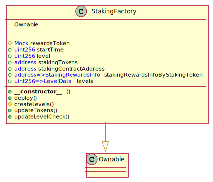
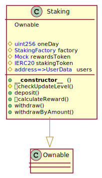

# Contracts

## 1. Staking Factory

-   The contructor takes a reward token(say RWD) and startTime.
-   It defines each level and level data.
-   The owner can deploy a pool(or a Staking contract) with staking token(say STK)

## Staking Contract

-   User can call deposit to deposit the staking tokens.
-   The tokens are locked in the contract. until duration ends.
-   -   withdrawByAmount allows User to withdraw tokens if requested amount of tokens are not locked.
-   withdraw allows User to withdraw tokens of a particular level.
